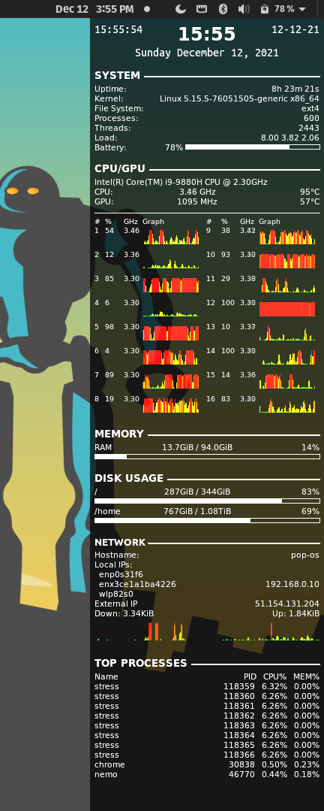

# conky

## Dependencies

```
sudo apt install cmake libimlib2-dev libncurses5-dev libx11-dev libxdamage-dev libxft-dev libxinerama-dev libxml2-dev libxext-dev libcurl4-openssl-dev liblua5.3-dev
```

For nvidia:

```
sudo apt install libxnvctrl-dev
```

## Build

Build with HTTP, NVIDIA and CURL flags.

```
ccmake ..
make
sudo make install
```

## Variables

http://conky.sourceforge.net/variables.html


## Config

Symlink to `~/.conkyrc`

```
ln -s conky.conf ~/.conkyrc
```

## How it looks


